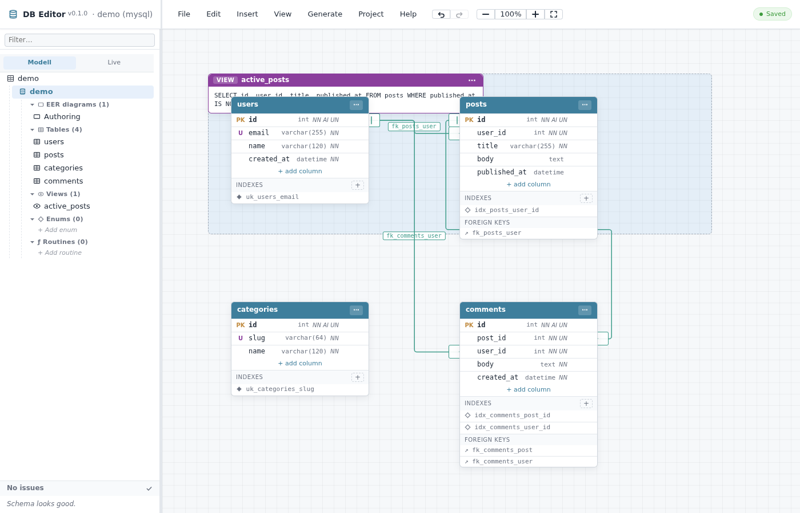
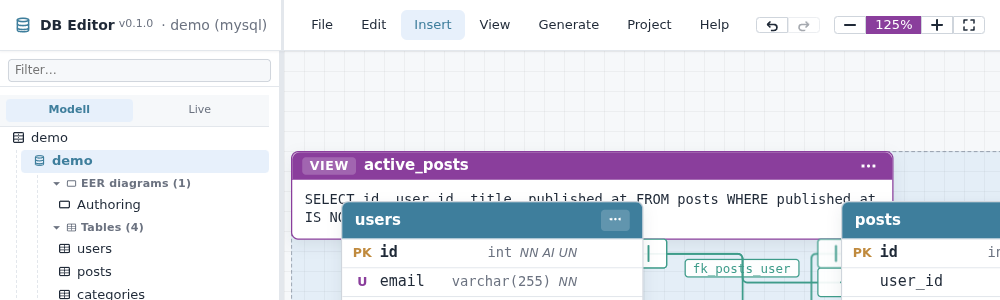
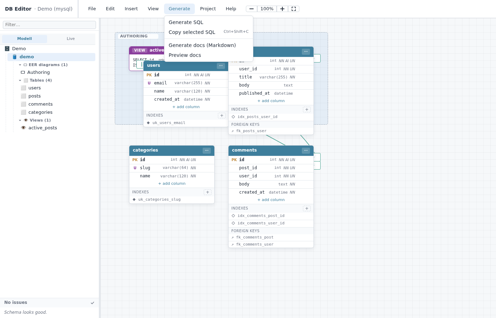
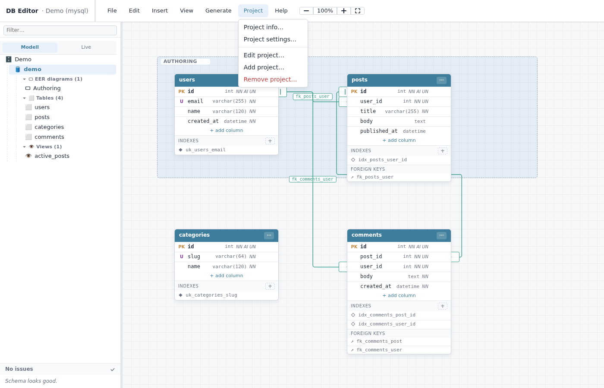
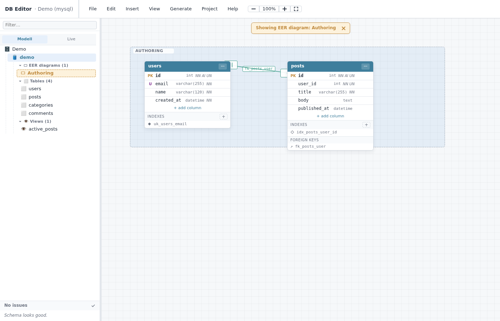
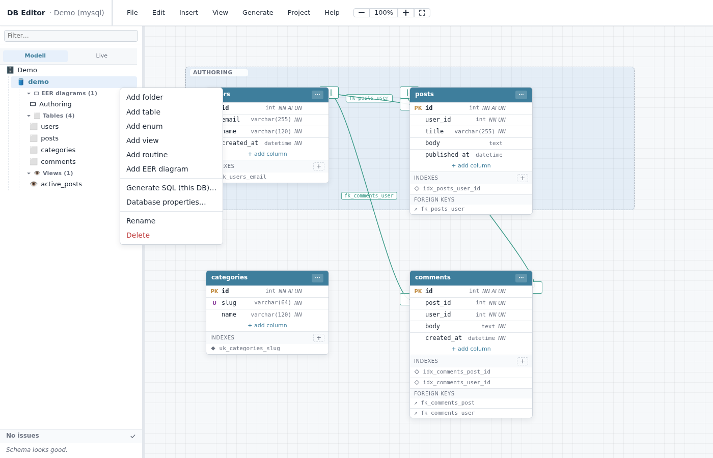
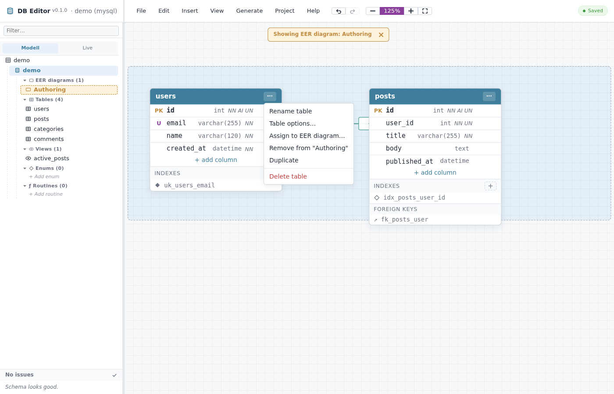
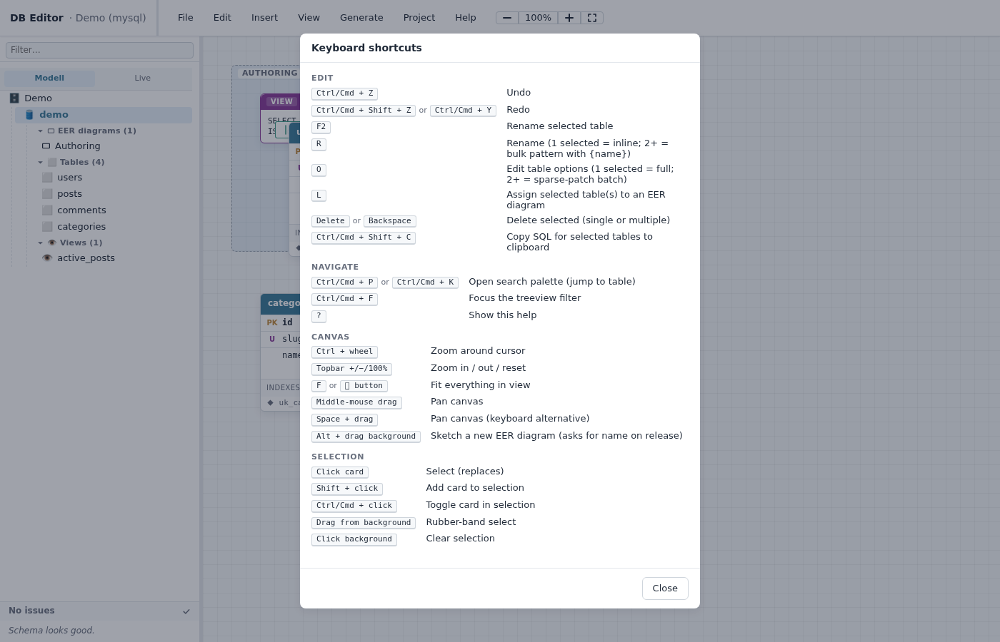

# DB Editor — User Guide (EN)

Browser-based visual editor for designing relational databases. The modeling half of MySQL Workbench, rebuilt to fit inside your project: one JSON file as the source of truth, regenerated SQL DDL on save, full forward-engineering workflow for **MySQL, MariaDB, PostgreSQL, and SQLite**.

> **Sprache / Language:** [English (this file)](./guide.en.md) · [Deutsch](./guide.de.md)

---

## Table of contents

1. [Overview](#overview)
2. [Getting started](#getting-started)
3. [Project configuration (`dbeditor.json`)](#project-configuration-dbeditorjson)
4. [Importing from a `.mwb` file](#importing-from-a-mwb-file)
5. [The editor UI](#the-editor-ui)
6. [Working with tables](#working-with-tables)
7. [Foreign keys](#foreign-keys)
8. [EER diagrams](#eer-diagrams)
9. [Views, enums, routines](#views-enums-routines)
10. [Generating SQL](#generating-sql)
11. [Live sync with a database](#live-sync-with-a-database)
12. [Keyboard shortcuts](#keyboard-shortcuts)
13. [Configuration reference](#configuration-reference)

---

## Overview



The screen above shows the editor with a demo schema (`users`, `posts`, `comments`, `categories` plus a view `active_posts`). The left panel is the **treeview** of every object in the schema; the centre is the **canvas** where you draw the relationships; the top is the **menubar**; the bottom-left is the **schema warnings panel**.

Everything you do is persisted to a single JSON file (the schema file, default `./schemas/database.json`). Generated SQL DDL files land in `output.destinationPath`. Both are regenerated on save when `autoGenerate` is on.

## Getting started

```bash
# inside your project
npm install --save-dev git+https://github.com/stefanwerfling/dbeditor.git
node ./node_modules/.bin/dbeditor          # or: npm run dev (if you wire it)
```

On first start, dbeditor creates a default `dbeditor.json` in the current directory if none exists, then opens the editor at `http://localhost:5274` (default port).

You can also clone and run directly:

```bash
git clone https://github.com/stefanwerfling/dbeditor.git
cd dbeditor
npm install
node ./cli/dev.js
```

## Project configuration (`dbeditor.json`)

The full reference is at the bottom of this file. A minimal example:

```jsonc
{
  "projects": [{
    "name": "MyDatabase",
    "schemaPath": "./schemas/database.json",
    "dialect": "mysql",             // mysql | mariadb | postgres | sqlite
    "output": {
      "mode": "ddl-files",          // ddl-files | migrations
      "destinationPath": "./schemas/sql"
    },
    "autoGenerate": false
  }],
  "server":  { "port": 5274 },
  "browser": { "open": false }
}
```

You can edit `dbeditor.json` directly, or use **Project → Add project / Edit project / Project info** from the menubar. The dev server restarts automatically when the file changes.

## Importing from a `.mwb` file

Use **File → Import .mwb…** to read an existing MySQL Workbench file. The dialog asks whether to **Append** (add to your current schema) or **Replace** (overwrite the entire schema file).

What gets imported:

- Schemas and their default charset / collation
- Tables, columns (with PK / NN / AI / UNSIGNED / UNIQUE / default / comment), indexes, foreign keys
- Views and their `SELECT` body, plus their canvas position (from `ViewFigure`)
- Routines (procedures, functions) and table-nested triggers
- Canvas positions for tables that had a `TableFigure` in any Workbench diagram
- EER diagrams (Workbench "Layers"), with each table assigned to its diagram
- **Multi-diagram table membership** — a table placed on more than one Workbench diagram becomes a member of each, with its per-diagram position preserved

The success alert reports how many of each (`Placed N of M tables and K of L views`, `Also: ... N tables on multiple diagrams`).

Roundtrip-preserving fields Workbench needs but dbeditor doesn't model are captured opaquely and re-emitted on export, so you can open → edit → save back to `.mwb` without losing data. The sample at `sample/example.mwb` is a small demo schema used by the round-trip tests.

## The editor UI

### Menubar

The top row carries the app name + version, the seven menus, inline **Undo / Redo** buttons, the zoom controls, and the auto-save indicator.

- **File** — Import / Export `.mwb`, Reload config
- **Edit** — Undo / Redo, Bulk rename, Assign to EER diagram (shortcut `L`)
- **Insert** — Add Table, Add Enum, Add EER diagram
- **View** — Zoom controls, Fit to view (`F`), N:N toggle
- **Generate** — Generate SQL, Copy selected SQL, Generate / Preview Markdown docs
- **Project** — Project info, Project settings, Add / Edit / Remove project
- **Help** — Keyboard shortcuts, About

The Undo / Redo arrows next to the zoom controls mirror the Edit-menu entries; they grey out when the active project has nothing on its stack.



The Generate menu:



The Project menu:



### Treeview

The left panel groups everything inside each database into collapsible buckets: **EER diagrams**, **Tables**, **Views**, **Enums**, **Routines**. A filter field on top hides non-matching rows while keeping their ancestors visible. Empty buckets show a faint **+ Add &lt;kind&gt;** hint that opens the same creation prompt as the container's `⋯` menu.

Above the tree, a **Modell / Live** toggle switches between the design view (Modell) and a read-only live snapshot of the configured database (Live). The Live tab carries a small badge with the number of databases that have a connection configured — when it's blank, there's nothing to switch to.

Click a row to make it the **active container** (the canvas shows everything in that scope). Click an EER diagram row to scope the canvas to that diagram only — the rest fades out and the diagram name appears as a sticky banner above the canvas:



Every row has a hover-only `⋯` menu with row-appropriate actions (rename inline, add child, delete, …). The database row's menu is the entry point for almost everything:



### Canvas

Tables, views, and EER-diagram backdrops sit on the canvas. Drag a card to move it; drag the SE corner of a diagram backdrop to resize it; double-click an item's title to rename inline.

Foreign keys are drawn as ER-style lines between two tables with crow's-foot or one-bar terminations. Dashed lines mean the FK is nullable; auto-cardinality reads the column's PK / UNIQUE / NOT NULL flags. N:N relationships through a junction table get an extra dashed line directly between the outer tables (toggle visibility with **View → N:N**).

Hovering an FK line highlights both endpoint column rows in a teal tint; hovering a column row from the other direction highlights every FK partner column it's wired to (and the hovered row itself). For a PK with many incoming references, this reveals at a glance how many tables depend on it.

### Warnings panel

Below the treeview, the warnings panel lists schema-validation issues (table without PK, AI without PK, dangling FK refs, …). Click a warning to jump to its database.

## Working with tables

Each card has a hover-only `⋯` menu in its header:



- **Rename table** — inline rename of the table name
- **Table options…** — engine, charset, collation, tablespace, comment
- **Assign to EER diagram…** — single-table multi-select dialog (this table can be in several diagrams)
- **Remove from "&lt;diagram&gt;"** — only when the canvas is scoped to a single EER diagram; clears the table's membership in that diagram without deleting it from the schema
- **Duplicate** — deep clone with `_copy` suffix
- **Delete table** — drops the table; cascades to FKs in other tables

### Columns

Each column row has its own hover-only `⋯` menu (edit, set as primary key, set auto-increment, delete). Click `+ add column` at the bottom of the column list to add one.

Drag a column row up or down to **reorder** it (4-px threshold so single clicks and double-clicks still work). A small green dot appears at the right edge of each row on hover — that's the **FK source grip**; drag from it to another table's column to create a foreign key.

### Indexes

The `INDEXES` section under the columns lists every non-primary index. Click `+` to add one, click an existing entry to edit its type / column list (with ASC/DESC + prefix length per column) / partial-index `WHERE` clause (where supported by the dialect).

### Foreign keys

Two ways:

1. **Drag from the green grip** on a column row to another table's column. The new FK opens an inline editor — adjust ON DELETE / ON UPDATE / constraint name.
2. **Click** an existing FK line on the canvas to edit it; drag its endpoints to re-route.

Composite foreign keys are rendered as one line per column pair so you can see every link visually. N:N junction tables (composite PK that's the union of two FKs to two outer tables) get an additional dashed `N:N via <junction>` line between the outer tables; toggle with **View → N:N**.

## EER diagrams

EER diagrams are visual grouping rectangles for a subset of your tables. A single schema can have many diagrams; tables can belong to one or several diagrams, each with its own per-diagram position.

### Creating a diagram

Three ways:

1. Treeview → database row `⋯` → **Add EER diagram** (see screenshot above)
2. Topbar **Insert → Add EER diagram**
3. **Alt + drag** on empty canvas space to sketch the bounding rectangle, name on release

### Adding tables to a diagram

Four ways:

1. **Drag a table card** onto a diagram's rectangle on the canvas. If the drop position lands inside the rectangle, the table becomes a member (its primary `layerUnid` is set if empty, otherwise an additional placement is added).
2. **Drag a treeview table row** onto a treeview EER-diagram row (blue drop-target highlight).
3. **Table card ⋯ menu → Assign to EER diagram…** opens a checkbox dialog. Tick every diagram this table should appear in. First checked becomes the primary diagram; the rest become additional placements with independent positions.
4. **Press `L`** with one or more tables selected.

### Multi-diagram positions

A table that's in two diagrams can sit at different coordinates in each. When the canvas is scoped to a diagram (you clicked the diagram's treeview row), dragging a card writes to that diagram's per-placement position. Outside any diagram scope, dragging writes to the table's "home" position used in the unscoped view.

## Views, enums, routines

- **Views** — open the view dialog (treeview double-click or canvas `⋯` → Edit body); fields: name + raw SELECT body in a monospace textarea + `MATERIALIZED` flag (Postgres only). Each view can be assigned to a single EER diagram via the card's `⋯ → Assign to EER diagram…`; in scoped view, only views belonging to that diagram appear.
- **Enums** — name + values list with inline editing. The dialog diffs your changes against the current state and fires the matching API calls.
- **Routines** — procedures, functions, and triggers. Body is raw SQL; the editor doesn't parse parameters.

## Generating SQL

Two output modes (`output.mode` in `dbeditor.json`):

- **`ddl-files`** — one `<table>.sql` per table, plus `<view>.view.sql`, plus `_enums.sql` (Postgres) and a single `_foreign_keys.sql` listed last (so loading alphabetically doesn't fail). Default.
- **`migrations`** — one timestamped `*.up.sql` / `*.down.sql` pair per generate run.

Trigger a generation via **Generate → Generate SQL**. **Copy selected SQL** (`Ctrl+Shift+C`) puts the DDL for the currently-selected cards on the clipboard without writing to disk. **Generate docs (Markdown)** writes per-database `.md` files to `<destinationPath>/docs/`; **Preview docs** does the same in a dialog without writing.

For a preview-only run scoped to one database or table without touching the output directory, use the treeview row's `⋯` menu → **Generate SQL (this DB)…** / **Generate SQL (this table)…** — both open a dialog with the file list and contents.

If `autoGenerate: true` in the project config, every save flushes both the schema JSON and the SQL output.

## Live sync with a database

The sync workflow is `model → live`: you treat the schema file as the source of truth and compute the DDL needed to make a live database match it.

### Set up a connection

Add a connection to `dbeditor.json`:

```jsonc
{
  "projects": [{
    "name": "MyDatabase",
    "dialect": "mariadb",
    "connections": [{
      "databaseUnid": "<the unid of a database container in your schema>",
      "host": "${DB_HOST:-localhost}",
      "port": 3306,
      "user": "${DB_USER}",
      "password": "${DB_PASSWORD}",
      "database": "myappdb",
      "ssl": false,
      "readOnly": false
    }]
  }]
}
```

The `${VAR}` and `${VAR:-default}` placeholders are resolved from `.env` at server boot, so credentials don't have to live in the JSON.

The same data is editable in the UI: **Project → Project info** lists connections with Test / Edit / Rebind / Remove actions, and **+ Add connection…** writes a new one. **Rebind** swaps a connection's `databaseUnid` when a schema reload regenerated UUIDs — preserves credentials.

### Preview the diff

Open **Treeview → database `⋯` → Sync with DB…** (the menu item only appears when a connection is configured for that database). The Sync dialog:

- Top status line reports how many changes the diff found
- Left list shows each change with a severity badge (`+` add, `~` modify, `!` destructive) and a checkbox
- Right pane has two tabs: **SQL** (joined DDL for currently-selected changes, copy with `Copy SQL`) and **Diff** (Live vs Model side-by-side card for the focused change)
- Footer: **Test connection**, **Ignore settings…**, **Refresh**, **Copy SQL**, **History…**, **Reverse apply…**, **Test run…**, **Apply…**

You can pair up rename candidates manually: a `tableDropped` row's `⋯` menu lists every `tableAdded` candidate as "Mark as rename → newname". The diff collapses the pair into a single `tableRenamed` change. Same for columns within an unchanged table.

### Test-run (dump → apply → restore)

The safe way to validate a change set before committing to it. Click **Test run…**, confirm in the dialog, and the server:

1. Dumps the live database to `<destinationPath>/sync-tests/<timestamp>__<dbname>.sql`
2. Runs every selected statement against the live DB
3. Always restores from the dump (even on full success)
4. Reports the outcome in the dialog

Three outcomes:

- **All green** — every statement ran cleanly; DB is back to its pre-test state; the SQL pane has what you'd put in a TypeORM migration
- **Apply failed cleanly** — one statement failed; DB was restored; the log shows which statement and the error
- **CRITICAL — restore failed** — sticky red banner with the dump path and a manual `mysql -h … < <dump>` recovery command; the live DB may be in indeterminate state and needs hand recovery

Requirements: `mysqldump` and `mysql` binaries on PATH; the connection user needs `RELOAD`, `LOCK TABLES`, `SELECT` (dump) plus `DROP`, `CREATE`, `ALTER`, `INSERT` (restore). MySQL/MariaDB only this iteration — Postgres/SQLite return 501 Not Implemented for now.

### Apply

**Apply…** is the production action: runs every selected statement against the live DB, writes a migration pair (`*.up.sql` + `*.down.sql`) to `<destinationPath>/migrations/`, and records a history entry. Confirms before running; destructive changes turn the dialog red.

**Dry-run** (checkbox in the dialog) wraps the batch in `BEGIN; … ROLLBACK;` — best-effort because most MySQL DDL implicitly commits.

### Reverse-apply

The opposite direction: **Reverse apply…** mutates the model to adopt the live DB's state for the selected changes. No SQL runs against the live DB. Useful when something was changed manually on the server and you want to bring the model back in sync.

### History

**History…** opens a chronological-reverse list of every Apply / Test-run / Reverse-apply run. Each row shows mode, timestamp, change summary (`tableAdded ×2 · columnDropped ×1`), and success / fail / CRITICAL status. Click a row → detail panel with:

- Metadata (status, duration, migration file paths, dump info, restore error if any)
- **Combined SQL** block with all statements joined for one-click copy → port to TypeORM / Doctrine / whatever
- Per-statement log with status icon + SQL + duration

Stored in `<schema dir>/sync-history.json`. Newest-first, append-only.

## Keyboard shortcuts



Open with **Help → Keyboard shortcuts** or `?`. Highlights:

| Keys | Action |
|---|---|
| `Ctrl/Cmd + Z` | Undo |
| `Ctrl/Cmd + Shift + Z` | Redo |
| `Ctrl/Cmd + K` or `Ctrl/Cmd + P` | Search palette (tables, columns, diagrams) |
| `Ctrl/Cmd + Shift + C` | Copy SQL for selected tables |
| `R` | Rename selected (inline if 1, bulk pattern if 2+) |
| `O` | Edit options for selected (1 = full, 2+ = sparse patch) |
| `L` | Assign selected table(s) to an EER diagram |
| `F` | Fit canvas to view |
| `Delete` / `Backspace` | Delete selected |
| `Alt + drag` (empty canvas) | Sketch a new EER diagram |
| `Shift / Ctrl + click` | Additive / toggle selection |
| `Drag` (empty canvas) | Rubber-band select |
| `?` | This help dialog |

## Configuration reference

The full `dbeditor.json` shape (authoritative source: `Config/Config.ts`):

```jsonc
{
  "projects": [{
    "name": "MyDatabase",
    "schemaPath": "./schemas/database.json",
    "dialect": "mysql",                         // mysql | mariadb | postgres | sqlite
    "output": {
      "mode": "ddl-files",                      // ddl-files | migrations
      "destinationPath": "./schemas/sql",
      "destinationClear": false,                // wipe dir before generating
      "sqlComment": true,                       // emit -- comments
      "sqlIndent": "    ",
      "statementTerminator": ";",
      "migrationFilenamePattern": "{timestamp}__{name}"
    },
    "scripts": {
      "before_generate": [{"script": "echo before", "path": "."}],
      "after_generate":  [{"script": "echo after",  "path": "."}]
    },
    "autoGenerate": false,
    "connections": [{
      "databaseUnid": "uuid-of-database-in-schema",
      "host": "${DB_HOST:-localhost}",
      "port": 3306,
      "user": "${DB_USER}",
      "password": "${DB_PASSWORD}",
      "database": "myappdb",
      "schema": "public",                       // Postgres only
      "ssl": false,
      "readOnly": false
    }],
    "sync": {
      "ignoreTables": ["temp_logs"],
      "ignoreColumnAttributes": ["comment"]
    }
  }],
  "server":  { "port": 5274, "limit": "10mb" },
  "browser": { "open": false }
}
```

- `dbeditor.json`, `schemas/`, and `.env` are gitignored by default — they're per-user.
- Project identity is a runtime UUID (regenerated each boot). The `databaseUnid` inside `connections[]` must match a database container in your schema file.
- `${VAR}` / `${VAR:-default}` placeholders are resolved from `process.env` after the JSON is parsed.
- `output.destinationPath` is relative to the project root (the directory containing `dbeditor.json`).